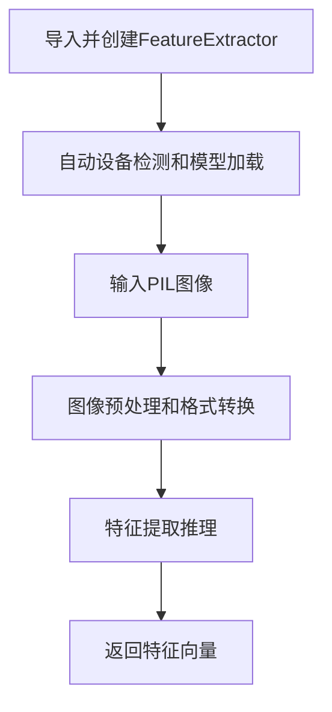

## 1. Product Overview

图像特征提取工具是一个基于深度学习的Python项目，使用预训练的ResNet-18模型从图像中提取高维特征向量。
- 主要解决图像相似性分析、图像检索和计算机视觉预处理等问题，面向机器学习工程师和研究人员。
- 项目目标是提供一个简单易用、高性能的图像特征提取解决方案，支持GPU加速、Mac M芯片MPS加速和批量处理。

## 2. Core Features

### 2.1 Feature Module

我们的图像特征提取项目包含以下主要功能模块：
1. **特征提取器**：核心FeatureExtractor类，设备自动检测，模型初始化。
2. **图像处理**：单张和批量图像处理，格式转换和预处理。
3. **测试验证**：单元测试，性能测试，示例代码。

### 2.2 Page Details

| 模块名称 | 功能名称 | 功能描述 |
|-----------|-------------|---------------------|
| 特征提取器 | 模型初始化 | 加载预训练ResNet-18模型，移除分类层，设置评估模式，自动检测MPS/GPU/CPU设备 |
| 特征提取器 | 特征提取 | 接收PIL图像或图像列表，进行预处理，批量推理，返回512维特征向量 |
| 图像处理 | 格式转换 | 支持RGB和灰度图像，自动转换为RGB格式，应用预训练模型的标准化变换 |
| 图像处理 | 批量处理 | 将多张图像堆叠为batch tensor，提高处理效率，支持任意数量图像 |
| 测试验证 | 单元测试 | 测试单张图像处理，批量处理，设备检测，错误处理等核心功能 |
| 测试验证 | 示例代码 | 提供完整的使用示例，包括虚拟图像创建和特征提取演示 |

## 3. Core Process

主要用户操作流程：
1. 用户导入FeatureExtractor类并创建实例
2. 系统自动检测可用设备（MPS/GPU/CPU）并加载预训练模型
3. 用户传入单张PIL图像或图像列表
4. 系统进行图像预处理和格式转换
5. 模型进行特征提取并返回numpy数组格式的特征向量
6. 用户获得可用于后续分析的高维特征表示

## 4. User Interface Design

### 4.1 Design Style

作为一个Python库项目，主要通过编程接口交互：
- 主要颜色：终端默认颜色（黑白）
- 输出样式：清晰的控制台日志输出
- 字体：等宽字体，便于代码阅读
- 布局风格：简洁的API设计，最小化参数配置
- 图标样式：使用文本符号和进度指示器

### 4.2 Page Design Overview

| 模块名称 | 界面元素 | UI描述 |
|-----------|-------------|-------------|
| 特征提取器 | 初始化日志 | 显示设备检测结果和模型加载状态，使用绿色表示成功 |
| 特征提取器 | 处理进度 | 批量处理时显示进度信息，包括处理图像数量和特征维度 |
| 测试验证 | 测试输出 | 清晰的测试结果显示，包括形状信息和性能指标 |

### 4.3 Responsiveness

项目主要面向命令行和Jupyter Notebook环境，支持跨平台运行（Windows、macOS、Linux），自动适配不同的硬件配置（CPU/GPU）。