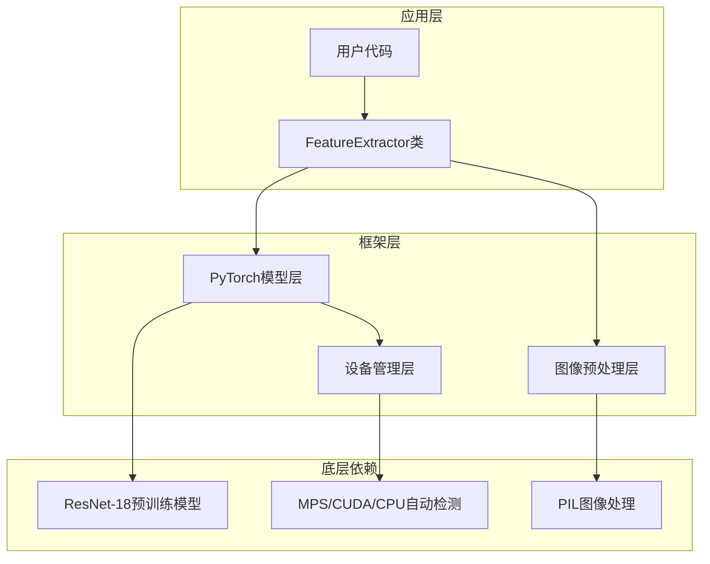
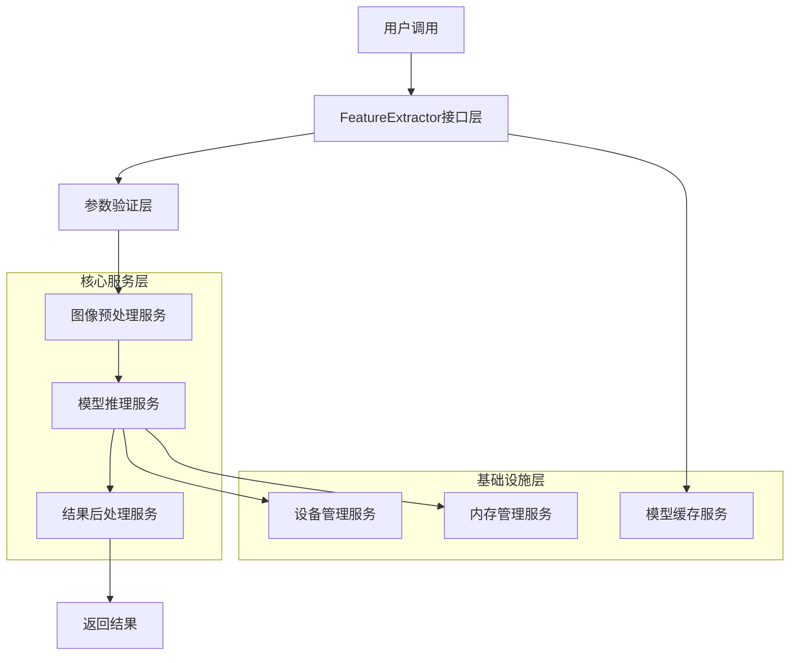
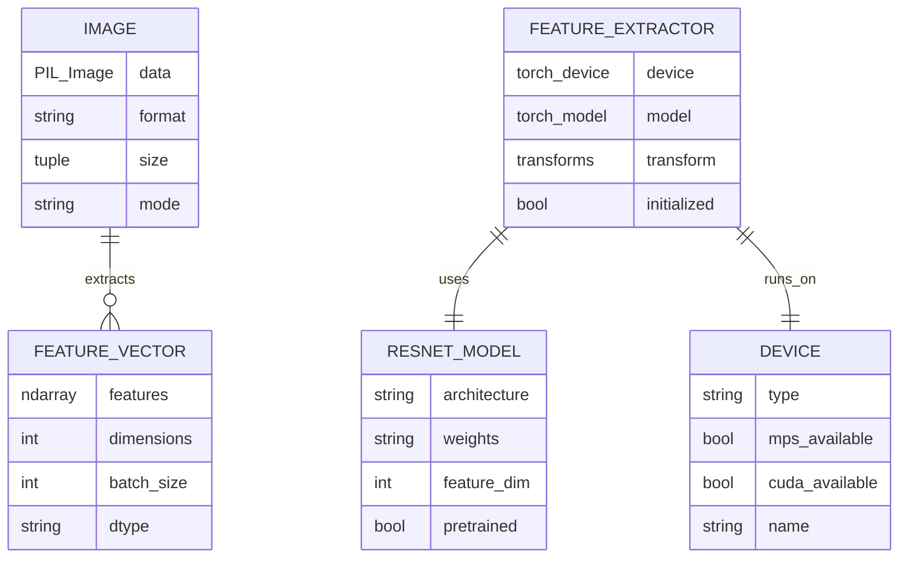

## 1. Architecture design



## 2. Technology Description

- Frontend: 无（纯Python库项目）
- Backend: Python@3.8+ + PyTorch@2.0+ + torchvision + PIL + numpy
- 核心依赖：torch, torchvision, pillow, numpy, typing

## 3. Route definitions

作为Python库项目，主要通过类和方法接口提供功能：

| 接口路径 | 功能描述 |
|-------|----------|
| FeatureExtractor.__init__() | 初始化特征提取器，加载模型和设置设备 |
| FeatureExtractor.extract() | 核心特征提取方法，支持单张和批量图像处理 |
| 示例脚本 | 演示如何使用特征提取器的完整示例 |

## 4. API definitions

### 4.1 Core API

**FeatureExtractor类初始化**
```python
__init__(device: str = None) -> None
```

参数说明:
| 参数名称 | 参数类型 | 是否必需 | 描述 |
|----------|----------|----------|------|
| device | str | false | 指定设备类型，如'mps'、'cuda'或'cpu'，默认自动检测 |

**特征提取方法**
```python
extract(images: Union[Image.Image, List[Image.Image]]) -> np.ndarray
```

参数说明:
| 参数名称 | 参数类型 | 是否必需 | 描述 |
|----------|----------|----------|------|
| images | Union[Image.Image, List[Image.Image]] | true | 单个PIL图像或PIL图像列表 |

返回值:
| 参数名称 | 参数类型 | 描述 |
|----------|----------|------|
| features | np.ndarray | 特征向量数组，形状为(N, 512)，N为图像数量 |

使用示例:
```python
from feature_extractor import FeatureExtractor
from PIL import Image

# 初始化
extractor = FeatureExtractor()

# 单张图像
image = Image.open('test.jpg')
features = extractor.extract(image)
print(features.shape)  # (1, 512)

# 批量图像
images = [Image.open(f'test_{i}.jpg') for i in range(5)]
features = extractor.extract(images)
print(features.shape)  # (5, 512)
```

## 5. Server architecture diagram



## 6. Data model

### 6.1 Data model definition



### 6.2 Data Definition Language

**项目结构定义**
```
img-ext/
├── feature_extractor.py      # 主要的特征提取器类
├── requirements.txt          # 项目依赖
├── setup.py                 # 安装配置
├── README.md                # 项目说明
├── tests/                   # 测试目录
│   ├── __init__.py
│   ├── test_feature_extractor.py
│   └── test_data/           # 测试图像
├── examples/                # 示例代码
│   ├── basic_usage.py
│   └── batch_processing.py
└── docs/                    # 文档
    └── api_reference.md
```

**依赖配置 (requirements.txt)**
```
torch>=2.0.0
torchvision>=0.15.0
Pillow>=9.0.0
numpy>=1.21.0
pytest>=7.0.0
```

**Mac M系列芯片特殊配置**
```
# 对于Mac M1/M2芯片，推荐使用以下版本以获得最佳MPS支持
torch>=2.0.0  # 确保MPS后端支持
torchvision>=0.15.0  # 与PyTorch版本匹配
```

**环境配置**
```python
# Python版本要求
Python >= 3.8

# 设备支持
# Mac M系列芯片：自动使用MPS (Metal Performance Shaders)
# NVIDIA GPU：CUDA >= 11.0 (for GPU acceleration)
# 其他：CPU fallback

# 内存要求
RAM >= 4GB (推荐8GB以上用于批量处理)
# Mac M系列芯片：统一内存架构，推荐16GB以上
```